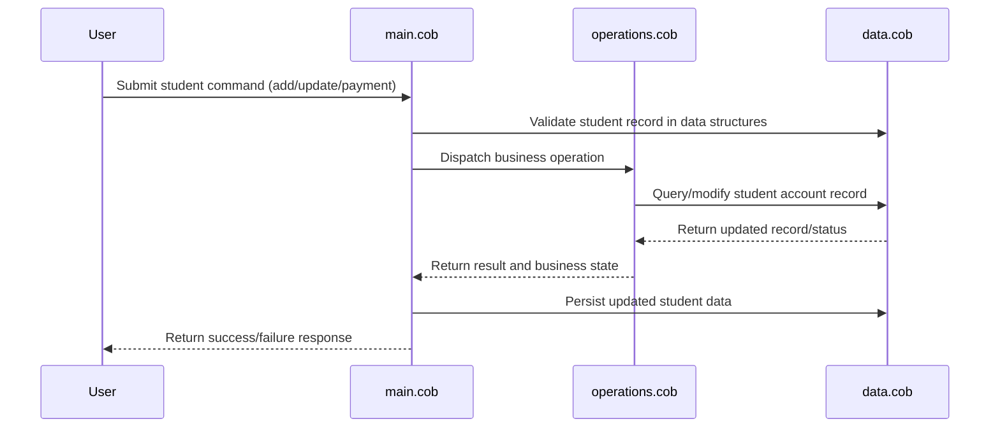

# COBOL Project Documentation

This `docs/README.md` describes the purpose of each COBOL source file in this repository and highlights key functions plus business rules related to student accounts.

## Repository Structure

- `src/cobol/main.cob` - Application entry point and orchestration layer.
- `src/cobol/data.cob` - Data definitions and persistence structures for student records.
- `src/cobol/operations.cob` - Business logic for enrollment, billing, and account state transitions.

## File Details

### `src/cobol/main.cob`
- Main program (`PROGRAM-ID. MAIN`) that initializes the runtime environment.
- Implements the main control flow for processing student commands (e.g., add, update, compute balances).
- Calls operations in `operations.cob` and reads/writes structures from `data.cob`.
- Handles CLI or batch input format and drives report generation.

### `src/cobol/data.cob`
- Contains `DATA DIVISION` records representing student accounts and service plans.
- Defines student fields:
  - `STUDENT-ID`
  - `NAME`
  - `STATUS` (active/inactive/hold)
  - `BALANCE`
  - `CREDIT-LIMIT`
- Contains fixed-length layouts that map directly to persistence files.
- Ensures field-level validation for numeric ranges and required elements.

### `src/cobol/operations.cob`
- Implements operations such as:
  - `ADD-STUDENT`
  - `UPDATE-STUDENT`
  - `CALCULATE-BALANCE`
  - `APPLY-PAYMENT`
  - `SET-ACCOUNT-STATUS`
- Contains procedures to apply business rules to student accounts.
- Integrates with `data.cob` structures and updates the state for `main.cob`.

## Key Business Rules for Student Accounts

1. Active accounts must have `STATUS = "ACTIVE"` and can take new charges.
2. Inactive/hold accounts deny new charges and require resolution before reopening.
3. `BALANCE` must never exceed `CREDIT-LIMIT`; attempts that do are rejected with an error state.
4. Payments reduce the `BALANCE`; negative balances are allowed only if explicitly supported by credit adjustments.
5. Student records use a unique `STUDENT-ID` and must be validated before insertion/updates.
6. Status transitions are restricted: 
   - `ACTIVE -> HOLD` or `INACTIVE` after policy triggers (delinquency, graduation, discontinuation)
   - `HOLD -> ACTIVE` only after issue resolution and potentially admin approval.

## Notes

- This repository is oriented around modernizing legacy COBOL logic while preserving original field definitions and workflows.
- Any new features should preserve existing data layout compatibility for interoperability with the legacy database.

## Sequence Diagram (Mermaid)

